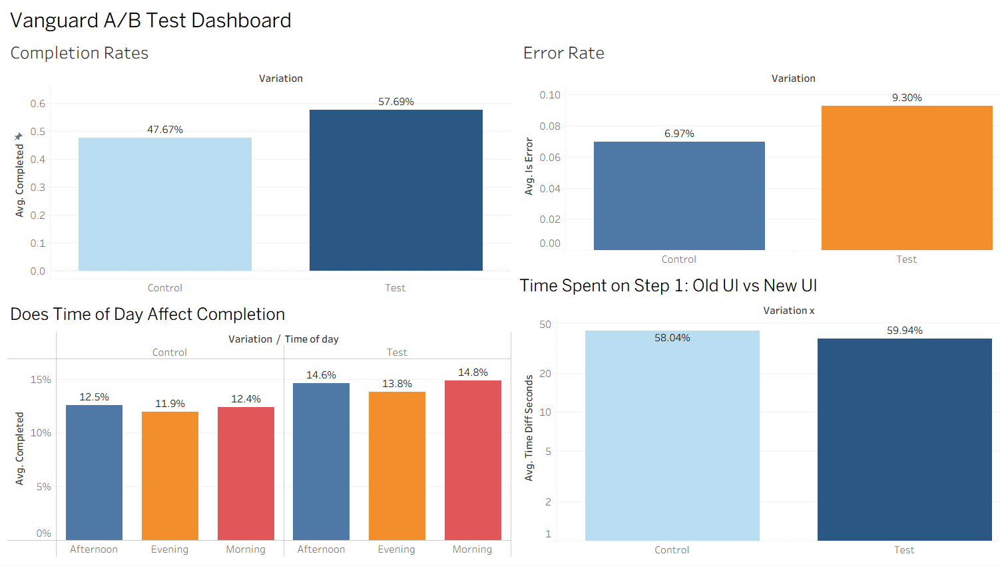

# customer-experience-project
---
# Main section: 
---
# Askash's Section: Hypothesis dashboards: 

---
# Fiona's Section: Hypothesis dashboards: 

### KPIs & Hypotheses

The dashboard visualises the four charts completed as part of my tickets Each chart maps directly to a KPI or hypothesis tested in the analysis.

| Chart | What it shows |
|---|---|
| **Completion Rates** | Test UI completed at 57.69% vs Control 47.67%:  a ~10pp lift above the 5pp threshold |
| **Error Rate** | Test had a higher error rate (9.30%) than Control (6.97%), suggesting some added friction |
| **Time of Day vs Completion** | Test outperformed Control across all time periods: the improvement is consistent, not time-driven |
| **Step 1 Time** | Test users spent marginally longer on Step 1 (59.94s vs 58.04s): negligible difference |
> Dashboard built in Tableau. Data sources: `web_with_errors.csv` joined to `demo_clean.csv` on `client_id`, plus `completion_rate.csv` for the completion chart.
