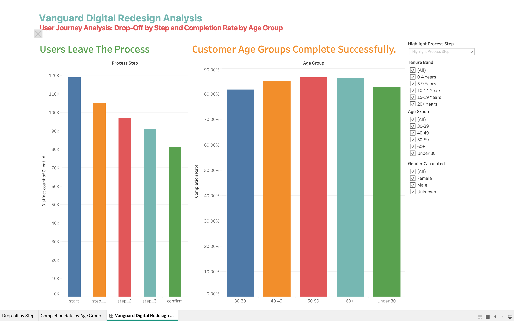

# customer-experience-project
---
# Project Overview

Vanguard, one of the world's largest investment management firms, ran an A/B test from **March 15 – June 20, 2017** to evaluate whether a redesigned digital process improved client outcomes. Clients were split into two groups:

- **Control** — experienced the existing (old) UI
- **Test** — experienced the redesigned (new) UI

## Datasets

### Original data
- **`demo_clean.csv`** — Cleaned client demographics (70,594 clients). Columns: `client_age`, `gender`, `balance`, `calls_last_6_months`, `client_tenure_years`, `logons_6_mnth`
- **`web_combined.csv`** — Merged web interaction data (parts 1 and 2 combined and sorted by `client_id`, `visit_id`, `date_time`). Covers 755,406 interactions.
- **`experiment.csv`** — Test/Control group assignment per client (50,500 participants), in the `Variation` column.

### Derived data (created during analysis)
- **`web_with_errors.csv`**  Web interaction data with an `is_error` flag marking backward navigation steps, joined with `Variation`.
- **`completion_rate.csv`**  One row per visit, with a `completed` flag and `Variation`, used to calculate completion rates.
- **`step1_times.csv`** Time spent on step 1 per visit, including `completed`, `Variation`, and `time_diff_seconds`.

## Methodology

1. **Data cleaning & EDA** Cleaned and standardized demographic data; explored client age, tenure, gender, and behavioral patterns (logons, calls).
2. **KPI calculation** Measured completion rate, error rate (backward navigation), and time spent per step, comparing Control vs. Test.
3. **Hypothesis testing** Ran statistical tests to determine whether observed differences between groups were significant.
4. **Experiment evaluation** Assessed whether the test design and duration were sufficient to draw reliable conclusions, and identified gaps in the data.
5. **Dashboard** Built an interactive Tableau dashboard to visualize results.

---
# Askash's Section: Hypothesis dashboards: 

# Fiona's Section: Hypothesis dashboards: 

### KPIs & Hypotheses

The dashboard visualises the four charts completed as part of my tickets Each chart maps directly to a KPI or hypothesis tested in the analysis.

| Chart | What it shows |
|---|---|
| **Completion Rates** | Test UI completed at 57.69% vs Control 47.67%:  a ~10pp lift above the 5pp threshold |
| **Error Rate** | Test had a higher error rate (9.30%) than Control (6.97%), suggesting some added friction |
| **Time of Day vs Completion** | Test outperformed Control across all time periods: the improvement is consistent, not time-driven |
| **Step 1 Time** | Test users spent marginally longer on Step 1 (59.94s vs 58.04s): negligible difference |
> Dashboard built in Tableau. Data sources: `web_with_errors.csv` joined to `demo_clean.csv` on `client_id`, plus `completion_rate.csv` for the completion chart.
